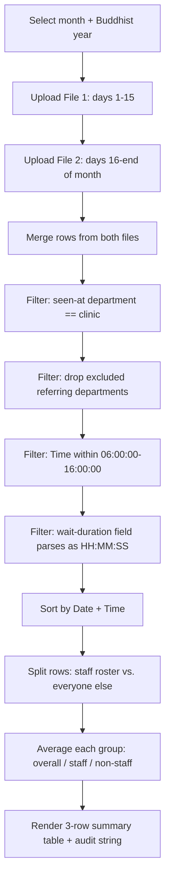

# OPD Waiting Time Calculator — Data Flow

Reference doc for porting the "ระยะเวลารอคอย" (waiting time) feature to another codebase. It describes the business rules and data pipeline, not the Next.js/Chakra specifics — the logic itself is plain, framework-free TypeScript with no backend involved.

**Source in this repo:**
- `src/lib/opd-calculator.ts` — all parsing/validation/calculation logic
- `src/components/opd-wait-time-calculator.tsx` — UI wiring only (file inputs, state, result table)

## Summary

Computes average patient waiting time at one OPD clinic from two CSV exports covering the two halves of a calendar month. Everything runs client-side in the browser: files are read with the File API, parsed and filtered in memory, and the result is rendered directly — nothing is uploaded, persisted, or sent to a server.

## Pipeline

## 1. Inputs

### 1.1 Month + year

- Month: 1–12.
- Year: Buddhist Era, 4 digits, `25xx` (2500–2599). Convert to Gregorian with `gregorianYear = buddhistYear - 543`.
- Compose a `YYYY-MM` key from the Gregorian year, used to validate every CSV row's `Date`.
- Compute the last calendar day of that month (handles month length and leap years) — this sets the expected end day of file 2.

### 1.2 Two CSV files, split by day-of-month

- **File 1**: rows for days 1–15 of the selected month.
- **File 2**: rows for days 16–(last day) of the selected month.
- Files are read with the browser File API (`file.text()`); no file-size limit is enforced.

The two-file split mirrors how the source hospital information system exports a month (two half-month reports) — it isn't a constraint of the calculation itself. A port that ingests one full-month file can skip the split and go straight to validation.

## 2. CSV schema

Required columns (exact header text, Thai):

| Column | Meaning |
|---|---|
| `Date` | Visit date, must render as `YYYY-MM-DD` in the selected month |
| `Time` | Time patient was seen, `HH:MM:SS`, 24h |
| `ส่งตรวจที่แผนก` | Referring department |
| `พบแพทย์ที่แผนก` | Department where the patient was actually seen |
| `ระยะเวลารอ` | Wait duration, `HH:MM:SS` |
| `แพทย์` | Attending doctor's name |

Parsing rules:

- Hand-rolled CSV parser (not a library): supports double-quoted fields with `""`-escaped quotes, strips a UTF-8 BOM from the first header cell, splits records on `\n`, strips trailing `\r` (CRLF-safe), and skips fully-blank rows.
- The header row must contain every required column. Order doesn't matter within one file, but **the two files' header rows must match exactly, in the same order** (checked again at the merge step).
- Every data row must have exactly as many cells as the header row, or the whole file is rejected.

Validation rules (applied per file, before the two files are merged):

- Every row's `Date` must match `^{selected-month}-DD$`, with `DD` inside that file's expected day range (1–15 for file 1, 16–last-day for file 2). Any row outside the expected month/range fails the whole file.
- Every calendar day in the file's expected range must be represented by **at least one row** — a file missing an entire day is rejected. This catches incomplete exports, not just malformed ones.

## 3. Merge + filter pipeline

Applied in this exact order once both files pass validation and the user starts processing:

1. **Header match** — reject if `firstFile.headers` and `secondFile.headers` aren't identical, in the same order.
2. **Merge** — concatenate file 1's rows then file 2's rows into one list.
3. **Clinic filter** — keep only rows where `พบแพทย์ที่แผนก` equals the target clinic name exactly (after collapsing whitespace and trimming). Hardcoded, single-clinic constant — porting to a different clinic means changing one string.
4. **Excluded-department filter** — drop rows where `ส่งตรวจที่แผนก` *contains* (substring match, not equality) any name in a hardcoded exclusion list. In this repo these are satellite/sub-district clinics whose patients shouldn't count toward the main OPD's wait time.
5. **Time-window filter** — keep only rows where `Time` parses as a valid `HH:MM:SS` **and** falls between `06:00:00` and `16:00:00` inclusive (clinic operating hours).
6. **Valid-duration filter** — keep only rows where `ระยะเวลารอ` also parses as a valid `HH:MM:SS`. Rows that pass every other filter but have an unparseable wait-duration are dropped here and counted separately in the audit string (§5), not silently discarded.

`HH:MM:SS` parsing (used for both `Time` and `ระยะเวลารอ`) is strict — `^([01]\d|2[0-3]):([0-5]\d):([0-5]\d)$` — and converts to seconds-since-midnight for comparison/averaging.

7. **Sort** — order surviving rows by `Date + " " + Time` as a plain string comparison. Safe because both fields are zero-padded, so lexicographic order matches chronological order.

## 4. Grouping and calculation

Split the sorted, filtered rows into two groups by the `แพทย์` field:

- **Staff** — the doctor's name *contains* (substring match, after whitespace normalization) any name in a hardcoded roster of the department's own attending staff.
- **Non-staff** — everyone else (in this repo's context: rotating residents).

If either group is empty after filtering, the whole calculation is rejected — a result always needs both groups represented.

For each of three groups — **all valid rows**, **staff only**, **non-staff only** — compute:

- Arithmetic mean of `ระยะเวลารอ` converted to seconds.
- Mean formatted as `HH:MM:SS` (rounded to the nearest second).
- Mean in decimal minutes, 2 decimal places (`seconds / 60`).
- Record count for that group.

## 5. Output

- A 3-row table: **overall average**, **staff average**, **non-staff average** — each with duration (`HH:MM:SS`), duration (decimal minutes), and record count.
- An audit/status string: both files' validated date ranges, total rows used vs. total rows across both source files, and — if any — how many rows were dropped specifically for an unparseable wait-duration value after passing every other filter.
- Nothing is persisted. Changing the month, year, or re-uploading a file clears all state and results; there's no history, export, or storage of any kind.

## 6. Values to re-supply when porting to a different deployment

These are hardcoded constants in `src/lib/opd-calculator.ts`, not configuration — a port to another clinic/hospital needs its own values:

| Constant | Current value | Purpose |
|---|---|---|
| `CLINIC` | `"ห้องตรวจศัลยกรรมกระดูก"` | Exact-match target for the "seen-at department" filter |
| `EXCLUDED_DEPARTMENTS` | `["วัดบางปลา", "วัดเกตุม"]` | Substring-match exclusion list for "referring department" |
| `STAFF_NAMES` | 15 physician names | Roster used to split staff vs. non-staff — not reproduced here since it's a personnel list; read the current list directly from `src/lib/opd-calculator.ts` when porting |
| Time window | `06:00:00`–`16:00:00` inclusive | Clinic operating-hours filter |
| `REQUIRED_COLUMNS` | the 6 columns in §2 | Must match the source system's actual export headers |

## 7. Error conditions (for parity when re-implementing)

Every one of these aborts the operation with a user-facing message; none fail silently:

- CSV has an unterminated quoted field.
- File has fewer than 2 rows (header only, or empty).
- File is missing one or more required columns.
- Any data row's cell count doesn't match the header's cell count.
- Any row's `Date` doesn't match the selected month.
- Any row's `Date` falls outside that file's expected day range (1–15 or 16–end).
- Any expected calendar day in the range has zero rows.
- The two files' headers don't match exactly (content or order).
- Zero rows survive the full filter pipeline.
- The staff group or the non-staff group is empty after filtering.

## Appendix: source functions (`src/lib/opd-calculator.ts`)

| Concept | Function(s) |
|---|---|
| CSV parsing | `parseCsv`, `parseFile` |
| Per-file validation | `parseAndValidateFilePart`, `validateFileDates` |
| Month key conversion | `toMonthKey`, `getLastDayOfMonth` |
| Time/duration parsing | `timeSeconds` |
| Staff roster match | `isStaff` |
| Full pipeline + aggregation | `calculateWaitTimes`, `makeSummary`, `average`, `formatDuration` |
